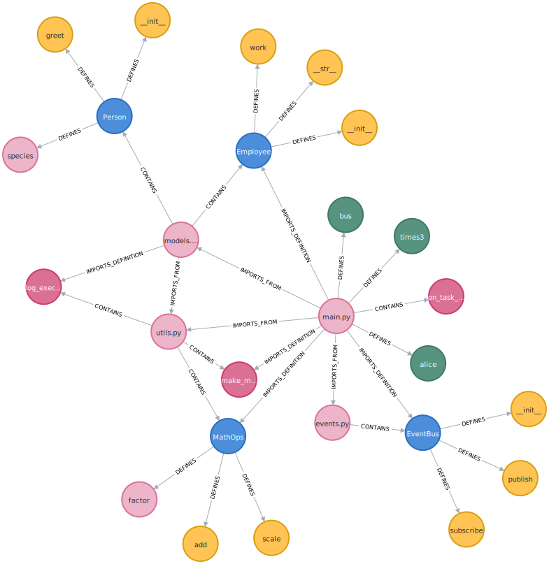

# Graph-Codebase-MCP

[ [English](README.md) | [繁體中文](docs/README-zh-TW.md) ]

Intelligent code search and analysis through Neo4j knowledge graphs

## Project Overview

Graph-Codebase-MCP is a specialized tool for creating knowledge graphs of codebases, combining Neo4j graph database with Model Context Protocol (MCP) to provide intelligent code search and analysis capabilities. The project utilizes Abstract Syntax Tree (AST) to analyze Python code structures and employs OpenAI Embeddings for semantic encoding, storing code entities and relationships in Neo4j to form a comprehensive knowledge graph.

Through the MCP server interface, AI agents can understand and search code more intelligently, surpassing the limitations of traditional text search and achieving a deeper understanding of code structure and semantics.

### Knowledge Graph Visualization Example

The following diagram shows a knowledge graph of [example codebase](./example_codebase):



The graph illustrates the network of relationships between files (pink), classes (blue), functions and methods (yellow), and variables (green), including:
- Import relationships between files (IMPORTS_FROM)
- Specific symbol imports from files (IMPORTS_DEFINITION)
- Class inheritance relationships (EXTENDS)
- Function call relationships (CALLS)
- Definition relationships between classes and their methods/attributes (DEFINES)

This structured representation enables AI to more effectively understand the structure and semantic relationships within code.

## Core Features

- **Code Parsing**: Utilize Abstract Syntax Tree (AST) to analyze Python code structures, extracting variables, functions, classes, and their relationships
- **Semantic Embedding**: Generate vector representations for code elements using OpenAI Embeddings to capture semantic characteristics
- **Knowledge Graph Construction**: Store parsed code elements and relationships in Neo4j graph database to form a complete knowledge graph
- **Knowledge Graph Visualization**: Intuitively display code structures and relationships through Neo4j's visualization capabilities
- **MCP Query Interface**: Provide an AI-agent-friendly query interface following the Model Context Protocol standard
- **Relationship Queries**: Support complex code relationship queries, such as function call chains and dependency relationships
- **Cross-File Analysis**: Accurately track dependencies between files, including module imports and symbol references

## Supported Programming Languages

- [x] Python
- [ ] Java
- [ ] C++
- [ ] JavaScript

## System Requirements

- Python 3.12.7 or higher
- Neo4j graph database (version 5.x recommended)
- Docker (optional, for containerized deployment)

## Installation Guide

### 1. Clone the Project

```bash
git clone https://github.com/eric050828/graph-codebase-mcp.git
cd graph-codebase-mcp
```

### 2. Install Dependencies

```bash
pip install -r requirements.txt
```

### 3. Configure Environment Variables

Create a `.env` file or use `mcp.json` to specify environment parameters:

`.env` file example:
```
NEO4J_URI=bolt://localhost:7687
NEO4J_USER=neo4j
NEO4J_PASSWORD=password
OPENAI_API_KEY=your_openai_api_key
```

Or `mcp.json` file example:
```json
{
  "mcpServers": {
    "graph-codebase-mcp": {
      "command": "python",
      "args": [
          "src/mcp_server.py",
          "--codebase-path",
          "path/to/your/codebase"
        ],
      "env": {
        "NEO4J_URI": "bolt://localhost:7687",
        "NEO4J_USER": "neo4j",
        "NEO4J_PASSWORD": "password",
        "OPENAI_API_KEY": "your_openai_api_key"
      }
    }
  }
}
```

### 4. Launch Neo4j

If using Docker:
```bash
docker run -p 7474:7474 -p 7687:7687 -e NEO4J_AUTH=neo4j/password neo4j:latest
```

Access the Neo4j browser at: http://localhost:7474

## Usage Instructions

### 1. Build the Code Knowledge Graph

Execute the main program to analyze the codebase and build the knowledge graph:

```bash
python src/main.py --codebase-path /path/to/your/codebase
```

### 2. Start the MCP Server

```bash
python src/mcp_server.py
```

## MCP Query Examples

This project supports various code-related queries, such as:

- Find all callers of a specific function: `"find all callers of function:process_data"`
- Find the inheritance structure of a specific class: `"show inheritance hierarchy of class:DataProcessor"`
- Query the dependencies of a file: `"list dependencies of file:main.py"`
- Find code related to a specific module: `"search code related to module:data_processing"`
- Cross-file tracking of symbol imports and usage: `"trace imports and usages of class:Employee"`
- Analyze the dependency network between files: `"analyze dependency network starting from file:main.py"`

## Architecture Overview

```
graph-codebase-mcp/
├── src/
│   ├── ast_parser/           # Code AST parsing module
│   │   └── parser.py         # AST parser implementation with cross-file dependency analysis
│   ├── embeddings/           # OpenAI Embeddings processing module
│   ├── neo4j_storage/        # Neo4j database operations module
│   ├── mcp/                  # MCP Server implementation
│   ├── main.py               # Main program entry point
│   └── mcp_server.py         # MCP Server startup entry point
├── examples/                 # Usage examples
├── tests/                    # Test cases
├── docs/                     # Documentation and diagrams
│   └── images/               # Image resources
├── .env.example              # Environment variable example
├── requirements.txt          # Dependency package list
└── README.md                 # Documentation
```

## Technology Stack

- **Programming Language**: Python 3.12.7
- **Code Analysis**: Python AST module
- **Vector Embedding**: OpenAI Embeddings
- **Graph Database**: Neo4j
- **Interface Protocol**: Model Context Protocol (MCP)
- **SDK Support**: MCP Python SDK, Neo4j Python SDK

## License

MIT License

## References

- [Neo4j GraphRAG Python Package](https://neo4j.com/blog/news/graphrag-python-package/)
- [Model Context Protocol](https://github.com/modelcontextprotocol/specification)
- [Neo4j Python Driver Documentation](https://neo4j.com/docs/api/python-driver/)
- [Python AST Module Documentation](https://docs.python.org/3/library/ast.html)

---


